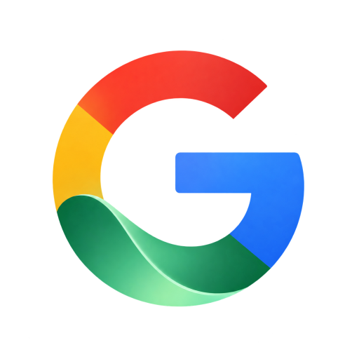
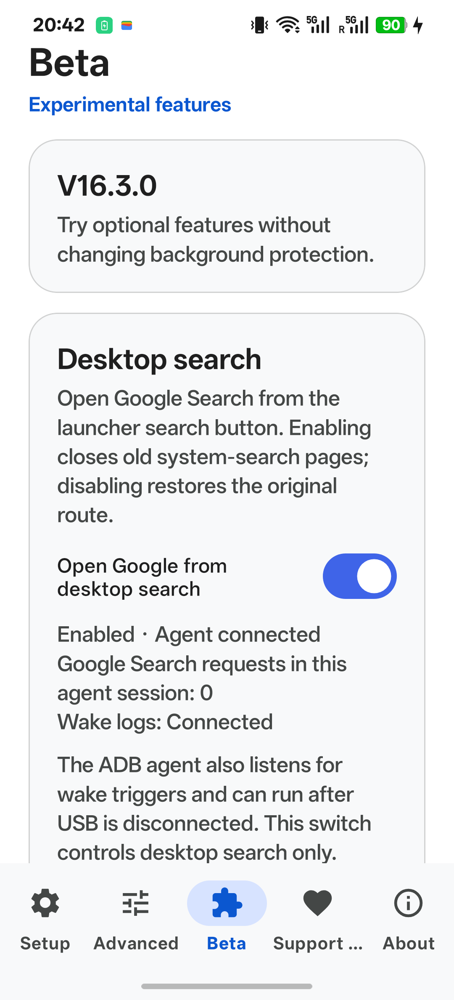
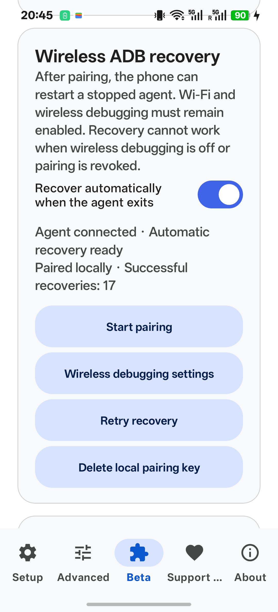

<p align="center"></p>

# ColorGoogle

**English** | [简体中文](README.zh-CN.md)

**Bring Gemini and Circle to Search to familiar ColorOS controls.** Hold the power button—even with the screen off—to open Gemini; hold the bottom gesture bar for Circle to Search; redirect the existing launcher search button to Google Search.

[Download 16.3.0](https://github.com/joeyandu/ColorGoogle/releases/tag/v16.3.0) · [Installation](#installation-computer-adb-recommended) · [Agent prompts](#how-to-use-with-an-agent) · [Troubleshooting](#troubleshooting) · [Changes](CHANGELOG.md)

ColorGoogle is an **open-source modification of [MindTrigger Assist v16.2.0](https://github.com/evokermc098-coder/MindTriggerAssist/tree/v16.2.0)** by **EvokerUniverse**. Its Circle to Search bridge derives from upstream's [MiCTS](https://github.com/parallelcc/MiCTS) integration by parallelcc. The combined application remains **GPL-3.0-only**. You can study, modify, build and redistribute it under that license; redistributed binaries must satisfy the corresponding-source requirements. See [LICENSE](LICENSE), [NOTICE](NOTICE.md) and [third-party notices](THIRD_PARTY_NOTICES.md).

This is an **unofficial community project**, not an OPPO or Google product. Names and logos do not imply endorsement. Code licensing does not grant trademark rights.

## Features

| Your action | Result | Where to configure |
|---|---|---|
| Hold the physical power button, including from a black screen | Open the configured Google/Gemini assistant session | Enable power triggering; choose Gemini as your Google assistant |
| Hold the bottom gesture bar | Circle to Search over the current screen | Enable the OEM long-press assistant gesture and ColorGoogle gesture triggering |
| Say the OEM wake phrase, such as **“小布小布”** | OEM voice wake is detected and routed to Gemini | Enable system voice wake and ColorGoogle voice triggering |
| Tap the existing ColorOS launcher search button | Google Search; Back returns to the launcher | **Beta → Open Google from desktop search** |
| Lose the ADB agent while local wireless debugging is available | Optional bounded reactivation on the phone | **Beta → Wireless ADB recovery** |

The launcher feature redirects the **existing ColorOS dock search route**. It does not add a separate widget or replace the launcher. Keep the system global-search package installed: Android must resolve the original intent before interception can occur.

### What changed from MindTrigger Assist v16.2.0?

| ColorGoogle milestone | Modification |
|---|---|
| .1 | Direct power-key events invoke Gemini without waiting for XiaoBu service logs; 2.5-second accepted-event deduplication; notification permission/status UX; ColorGoogle branding and zero-delay default |
| .2–.3 | Four-color G with green ribbon; more whitespace across adaptive, legacy and in-app icons |
| .4 | Opt-in desktop-search interception before the system-search launch, plus cleanup of stale search tasks |
| .5 | Shared shell-agent wake logs; foreign-UID health verification; separate log/agent state instead of trusting an own-UID heartbeat |
| .6 | Optional phone-local wireless pairing and bounded agent recovery; lifecycle/lock cleanup and quiet-start checks |
| **16.3.0** | First public release, English first-install default/new-feature text, device-neutral activation script, bilingual usage/recovery documentation and Agent prompts |

The inherited CTS invocation protocol remains unchanged. See [full changes](CHANGELOG.md) and [architecture](docs/ARCHITECTURE.md). Voice prompt prefixes, a standalone Google search widget and a public external Gemini-launch API are not included.

### Compatibility and limits

- Device evidence is from **OPPO Find X8 Ultra / PKJ110, Android 16, ColorOS 16.0.10.501**. See the [validation record](docs/VALIDATION.md) for version-specific checks. Other models, launchers, firmware and Google builds are unverified.
- APK minimum: **Android 12L / API 32**. Being installable does not establish feature compatibility.
- Requires working Google services, Google app and Gemini access for your account/region. Open Google and Gemini and complete their setup first.
- No root is required. A computer with ADB is the recommended setup route; Shizuku is not required.
- Once the shell agent is started, the USB cable can be disconnected. **This is not permanent privilege or a guarantee of survival after reboot, force-stop or process termination.**
- Wireless recovery needs the watcher running, a Wi-Fi connection, wireless debugging enabled and valid local pairing. It cannot turn wireless debugging back on. Repeated incidents on the test phone had wireless debugging off; its cause has not been established.
- Hidden Android/ColorOS APIs are used. OS/Google updates may break behavior. Do not run desktop interception together with `am monitor`, `monkey` or another activity controller.
- New installations default to **English**. Existing explicit language choices are retained. Inherited Vietnamese, Indonesian and Thai packs remain available; new Beta/status text is English. Chinese documentation does not imply a Chinese app translation.

## Screenshots

ColorGoogle 16.3.0 on the tested OPPO. Desktop search and wireless recovery live under Beta. Screens show only app settings, with no account or pairing details.

<p></p>

## Installation: computer ADB recommended

> **O+Connect users: USB connection warning**
>
> On our tested Mac and OPPO phone, O+Connect’s background service initiated a switch to Android Accessory mode when USB was connected. This was associated with an ADB daemon restart and termination of ColorGoogle’s privileged agent, causing wake and search features to stop even though app permissions remained granted.
>
> Closing the O+Connect window was not enough: its background service remained active. After disabling its background service and automatic startup, repeated USB reconnection tests no longer reproduced the issue.
>
> If you encounter this problem, check O+Connect’s background services and startup settings, then reactivate ColorGoogle through ADB once the USB connection is stable. Disabling those services can affect O+Connect’s connectivity features. Recheck them after software updates.
>
> **Windows has not been tested. A similar conflict may be possible, but this is currently unconfirmed.** These findings apply to the tested setup, not every computer or phone.

### 1. Prepare and install

1. Download `ColorGoogle-16.3.0.apk`, `SHA256SUMS` and the matching source ZIP from [Releases](https://github.com/joeyandu/ColorGoogle/releases/tag/v16.3.0). The source ZIP includes `tools/activate-agent.sh`.
2. Install Google's [SDK Platform-Tools](https://developer.android.com/tools/releases/platform-tools). On macOS with Homebrew, `brew install --cask android-platform-tools` is an alternative. Windows users can unzip the official Windows package and use `adb.exe` directly.
3. Enable Developer options and USB debugging, connect a data-capable cable and accept the phone's debugging prompt. Run `adb devices -l`. Replace `SERIAL` in every example with your selected physical device. Do not run commands against an unspecified device when multiple devices are connected.
4. Verify the download against `SHA256SUMS`:

macOS:
```bash
shasum -a 256 ColorGoogle-16.3.0.apk
adb devices -l
adb -s SERIAL install -r ColorGoogle-16.3.0.apk
```

Windows PowerShell (adjust the local path):
```powershell
$adb = "$env:USERPROFILE\Downloads\platform-tools\adb.exe"
Get-FileHash .\ColorGoogle-16.3.0.apk -Algorithm SHA256
& $adb devices -l
& $adb -s SERIAL install -r .\ColorGoogle-16.3.0.apk
```

**Check existing installations first.** The package remains `dev.evoker.homeholdcts`. Official MindTrigger and independently signed builds cannot be updated with this APK if their certificates differ. Do not respond to `INSTALL_FAILED_UPDATE_INCOMPATIBLE` by automatically uninstalling: backup is disabled and reinstalling loses app settings/pairing. Record settings and decide explicitly. Previous ColorGoogle builds signed with this project's release key can be updated in place. [Signing and builds](SIGNING.md).

### 2. Configure phone settings

- Open **Google** and **Gemini**, sign in and select Gemini as your mobile assistant. Set Google as the phone's default digital assistant.
- In ColorOS navigation settings enable the option that opens the system assistant when the bottom gesture bar is held. Menu wording varies by firmware.
- In ColorGoogle allow **notifications** and **Display over other apps**, allow background running and enable the main service. Denying notifications does not itself mean the service stopped, but prevents the pairing-code notification flow.
- Allow ColorGoogle, Google and Gemini to run in the background and auto-launch where those settings exist. Lock ColorGoogle in Recents if offered. This reduces restrictions; it is not a survival guarantee.
- Set power → Assistant/Gemini, gesture → Circle to Search, delay → **0 ms**; keep **Swap CTS ↔ Google Assistant** off for those mappings.
- In Gemini enable **use on the lock screen** if you want screen-off invocation. Sensitive requests may still require unlocking. Do not enable unrelated lock-screen calls/messages just for ColorGoogle.

### 3. Apply basic permissions, then activate the agent

Read [ADB setup and recovery](docs/ADB.md) first. It shows how to save original settings, apply the minimum commands, optionally add app-level battery exemptions and restore changes. **Permission grants alone do not start the shell agent.** The inherited one-shot setup contains broader system changes; it is not equivalent to this minimal route.

With the matching source ZIP extracted, run from its root:

macOS:
```bash
adb -s SERIAL push tools/activate-agent.sh /data/local/tmp/colorgoogle-activate.sh
adb -s SERIAL shell sh /data/local/tmp/colorgoogle-activate.sh
adb -s SERIAL shell content call --uri content://dev.evoker.homeholdcts.desktopsearch --method status
```

Windows PowerShell:
```powershell
& $adb -s SERIAL push .\tools\activate-agent.sh /data/local/tmp/colorgoogle-activate.sh
& $adb -s SERIAL shell sh /data/local/tmp/colorgoogle-activate.sh
& $adb -s SERIAL shell content call --uri content://dev.evoker.homeholdcts.desktopsearch --method status
```

The script runs **on Android**. It restarts only ColorGoogle's agent and uses the installed APK; it does not download executable code. The Beta page also has **Copy ADB activation command** for macOS/Linux shells; replace `SERIAL`. Use the script method on Windows to avoid PowerShell/Android-shell quoting issues.

Confirm the running version, empty error fields and `wakeActive=true`. That is log-path health, **not final functional acceptance**. Test the actual controls below. If using the inherited app-UID log reader instead, Android may ask for device-log access; its approval is session-scoped.

## Use each feature

### Screen-off Gemini and Circle to Search

1. Close overlays, turn the screen off, then hold the physical power button for about 1–2 seconds and release. Verify that Gemini visibly opens. A successful internal call alone is not proof.
2. Unlock and return to content you want to search. Hold the bottom gesture bar, then circle or tap something in the Google overlay.
3. Leave at least **2.5 seconds** between distinct tests. Duplicate power markers and their OEM service tail are suppressed without extending that interval.

### Voice wake: use the system phrase

**Say “小布小布” on the tested ColorOS phone—not “Hey Google” as a ColorGoogle trigger.** Enable and test OEM voice wake first, then enable voice triggering in ColorGoogle. The OEM wake service detects speech; ColorGoogle routes its event to Gemini. This project does not implement always-listening speech recognition or unlock Google's Voice Match eligibility.

Do not remove all OEM voice components. The tested setup keeps `com.oplus.ovoicemanager`. Conflicting XiaoBu UI components may require separate handling on this firmware; see [OEM conflicts and restoration](docs/ADB.md#oem-conflicts-optional). Package names and behavior are device-specific.

### Desktop search

Open **Beta → Desktop search → Open Google from desktop search**. With the agent connected, tap the launcher's search button. Google Search should open; Back should return to the launcher, not an old system-search page. Turning this switch off restores the original search route and does not disable power/gesture monitoring.

### Optional wireless recovery

1. Keep Wi-Fi connected and enable Android **Wireless debugging**.
2. Allow ColorGoogle notifications, open **Beta → Wireless ADB recovery → Start pairing**.
3. In system settings choose **Pair device with pairing code**. Keep that window open; expand ColorGoogle's notification and reply with the displayed six-digit code. Do not post pairing codes in issues.
4. Return to ColorGoogle and enable **Recover automatically when the agent exits**.
5. Check that the page reports paired/ready. **Retry recovery** retries after you fix an error; **Delete local pairing key** disables recovery and requires pairing again.

Recovery is bounded to three attempts per endpoint/outage. Disabling recovery leaves a healthy agent running. It cannot recover while the app is force-stopped, Wi-Fi unavailable, pairing invalid, or wireless debugging off. Shizuku's inherited setup option is not an automatic manager for this custom shell agent.

## Gemini connected apps

After Gemini opens, it can use connected apps supported by Google for your account, region and language. Configure **Gemini → Connected apps**, including Google Workspace and Spotify where available. Account linking and, for these integrations, Google's **Keep Activity** setting may be required. These are **Gemini features, not APIs newly implemented by ColorGoogle**.

| App | Example request after opening Gemini |
|---|---|
| Spotify | “Play my Discover Weekly playlist on Spotify.” |
| Google Tasks | “Add buy milk tomorrow to Google Tasks.” |
| Google Calendar | “Create a Google Calendar event tomorrow at 3 PM called Project review.” |
| Google Keep | “Create a Google Keep note called Shopping with milk and bread.” |

Check the actual target app after the request. Availability and lock-screen confirmation requirements can change. Official help: [Connected apps](https://support.google.com/gemini/answer/13695044), [Spotify/media](https://support.google.com/gemini/answer/15300097), [Tasks](https://support.google.com/gemini/answer/15230285), [Calendar](https://support.google.com/gemini/answer/15305236), [Google Workspace/Keep](https://support.google.com/gemini/answer/15229592).

## How to use with an Agent

You can paste these prompts into **Codex, Claude Code, or another Agent with terminal/device tools**. A chat-only model (including a model named DeepSeek without tool access) can guide you but cannot operate your computer. You must handle phone approval dialogs, lock-screen interactions and physical trigger tests. Review proposed system changes.

### General prompt
```text
Help me install and configure ColorGoogle from https://github.com/joeyandu/ColorGoogle.
Read the current README, ADB guide and Release before acting. Identify my computer OS,
check ADB and list devices. Select the single physical phone explicitly; ask me to
choose if multiple phones are connected. Always target that serial.
Download the official project Release APK and compare its SHA-256 with SHA256SUMS.
Check existing installation/signature compatibility. Preserve data with an in-place
update when compatible. Never automatically uninstall after a signature conflict;
explain data/pairing loss and wait for my decision.
Save original settings before applying documented basic permissions and starting the
ADB agent. Guide notification, overlay, background/autostart, gesture and Gemini
lock-screen settings. Default to computer ADB without root or Shizuku. Do not silently
remove OEM components, clear data or disable system optimization. Explain optional
system-wide retention changes and wireless recovery before I choose them.
Verify actual Gemini, Circle to Search, OEM voice wake and desktop search/Back behavior,
then ask me to disconnect USB and repeat. Check logs and UI, not just permissions or
notifications. Stop on errors, preserve the evidence and report the exact failed step.
Finish with the version, changed settings, test results and restoration instructions.
```

### macOS prompt
```text
I use macOS. Help me install https://github.com/joeyandu/ColorGoogle following its
current README and docs/ADB.md. Check command -v adb and adb version first.
If absent and Homebrew already exists, run brew install --cask android-platform-tools.
Otherwise use Google's official macOS SDK Platform-Tools; do not install Homebrew just
for this task. Run adb devices -l, guide the USB authorization dialog, and explicitly
select my phone (ask if multiple devices). Use adb -s SERIAL for every device operation.
Download the project Release APK/source/SHA256SUMS. Compare shasum -a 256 output.
Check signature compatibility before adb -s SERIAL install -r APK_PATH. A conflict is
not permission to uninstall; explain data loss and ask. Save original settings, apply
only the documented basic setup, then push tools/activate-agent.sh and run it with
adb shell sh as shown in the guide. Do not execute scripts from unrelated websites.
Guide phone-side permissions and retention. No root, automatic OEM uninstallation,
data clearing or system-optimization disabling. Discuss optional wider changes first.
Verify real trigger interfaces and logs, including unplugged tests with my help.
Report failures precisely and provide the changed settings and restoration commands.
```

### Windows PowerShell prompt
```text
I use Windows. Help me install https://github.com/joeyandu/ColorGoogle following its
current README and docs/ADB.md. Check Get-Command adb -ErrorAction SilentlyContinue.
If needed, download Google's official Windows SDK Platform-Tools into my user folder;
use the full adb.exe path without changing global PATH or PowerShell execution policy.
Use & "PATH\adb.exe" devices -l, handle USB authorization and select my physical phone
explicitly (ask if multiple devices). Always include -s SERIAL. If missing, diagnose
cable/USB state and official drivers; do not install untrusted drivers.
Download the project Release APK/source/SHA256SUMS and compare Get-FileHash APK_PATH
-Algorithm SHA256. Check installed-package signature compatibility before install -r.
Never uninstall or clear data automatically. Explain a conflict and wait for my choice.
Save original settings, follow basic ADB setup, push tools\activate-agent.sh and run
it on Android with adb shell sh. Do not paste Bash substitutions/continuations into
PowerShell; use the documented PowerShell-safe commands.
Guide phone permissions, background retention and actual functional tests. No root,
automatic OEM removal or system-optimization changes. Explain optional changes first.
Ask me to test physical buttons/OEM voice and repeat with USB disconnected. Verify UI
and logs; report exact errors, changes, results and restoration instructions.
```

## Troubleshooting

| Symptom | Check/action |
|---|---|
| Features stop after connecting USB | Check whether O+Connect is switching the phone into Android Accessory mode. Closing its window may leave its background service running. Review its background/startup settings, then reactivate ColorGoogle through ADB once USB is stable. Observed on the tested Mac; Windows remains untested. |
| All controls stopped responding | Inspect **Beta** agent status. `READ_LOGS` can still be granted while the agent is gone. Reactivate with the computer script. |
| Wireless recovery cannot restart it | Check Wi-Fi, system wireless debugging, pairing and the main service. It cannot enable disabled wireless debugging. |
| Search works but power/gesture does not | Check wake-log health separately from controller status; `wakeActive=true` must be followed by real trigger tests. |
| Notification missing | Check app permission and notification channel. This alone does not prove the service stopped. |
| First Circle to Search call fails | Open Google, finish setup and verify the active assistant, then retry. |
| XiaoBu appears as well | Verify OEM settings and consult the optional conflict section; do not uninstall every voice component. |
| Back exposes system search | Confirm this version's interception is enabled and the correct launcher route is used; keep the global-search package installed. |
| Updated/rebooted/force-stopped | Open ColorGoogle and inspect status. Restart the agent or restore wireless recovery prerequisites. |
| ADB shows no phone | Check authorization, cable and which ADB server/port your tools use; do not assume a granted permission was revoked. |

Public bug reports should include model, Android/ColorOS version, app version, trigger,
agent state, recovery prerequisites and reproduction steps. **Remove serials, account
names, pairing codes, tokens and unrelated logs.** [Issue guide](CONTRIBUTING.md).

## Build, architecture and privacy

Use **JDK 17 and Android SDK 36**. See [SIGNING.md](SIGNING.md) for debug/release builds and signature compatibility. The release key is not in the repository. [Architecture](docs/ARCHITECTURE.md) explains the shell agent, Binder boundaries, deduplication and local wireless recovery. [Validation](docs/VALIDATION.md) separates historical evidence from this release's checks.

ColorGoogle processes trigger events locally and has no developer telemetry backend. Wireless recovery uses a phone-local ADB connection and a private, non-backed-up pairing key. Google services process requests under Google's policies. Diagnostic files can contain device details; review before sharing. See [privacy and permissions](TERMS_AND_PRIVACY.md).

Contributions and device reports are welcome. Keep changes focused and preserve authorship, licenses and device-specific limits. See [CONTRIBUTING.md](CONTRIBUTING.md).
